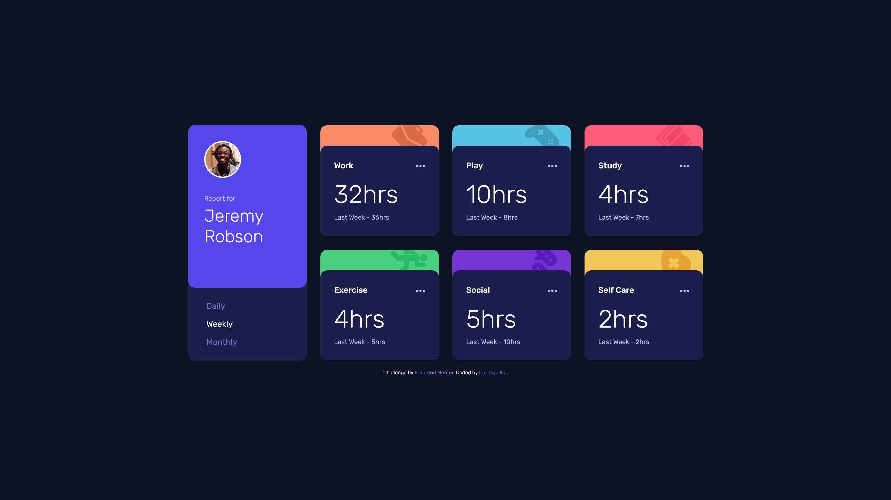

# Frontend Mentor - Time tracking dashboard solution

This is a solution to the [Time tracking dashboard challenge on Frontend Mentor](https://www.frontendmentor.io/challenges/time-tracking-dashboard-UIQ7167Jw). Frontend Mentor challenges help you improve your coding skills by building realistic projects. 

## Table of contents

- [Overview](#overview)
  - [The challenge](#the-challenge)
  - [Screenshot](#screenshot)
  - [Links](#links)
- [My process](#my-process)
  - [Built with](#built-with)
  - [What I learned](#what-i-learned)
  - [Continued development](#continued-development)
- [Author](#author)

**Note: Delete this note and update the table of contents based on what sections you keep.**

## Overview

### The challenge

Users should be able to:

- View the optimal layout for the site depending on their device's screen size
- See hover states for all interactive elements on the page
- Switch between viewing Daily, Weekly, and Monthly stats

### Screenshot

### Links

- Solution URL: [https://github.com/yvma0/time-tracking-dashboard](https://github.com/yvma0/time-tracking-dashboard)
- Live Site URL: [https://yvma0.github.io/time-tracking-dashboard/](https://yvma0.github.io/time-tracking-dashboard/)

## My process

### Built with

- Semantic HTML5 markup
- CSS custom properties
- Flexbox
- CSS Grid
- Mobile-first workflow
- Vanilla JavaScript

### What I learned

I revisited CSS Grid with this, in an effort to create a responsive display without having to use (too many) media query breakpoints. I also played around with clamp for font sizes, to limited effect. I hadn't accounted for both mobile and desktop formatting from the start, so I ended up having to use a breakpoint anyways... :') Something I'll have to remember for next time.

### Continued development

I want to keep practicing with Grid and fluid layouts. Additionally, I could never figure out how to isolate the hover state between the card and the ellipses button; that's something I'll have to keep looking into.

## Author

- Frontend Mentor - [@yvma0](https://www.frontendmentor.io/profile/yvma0)
